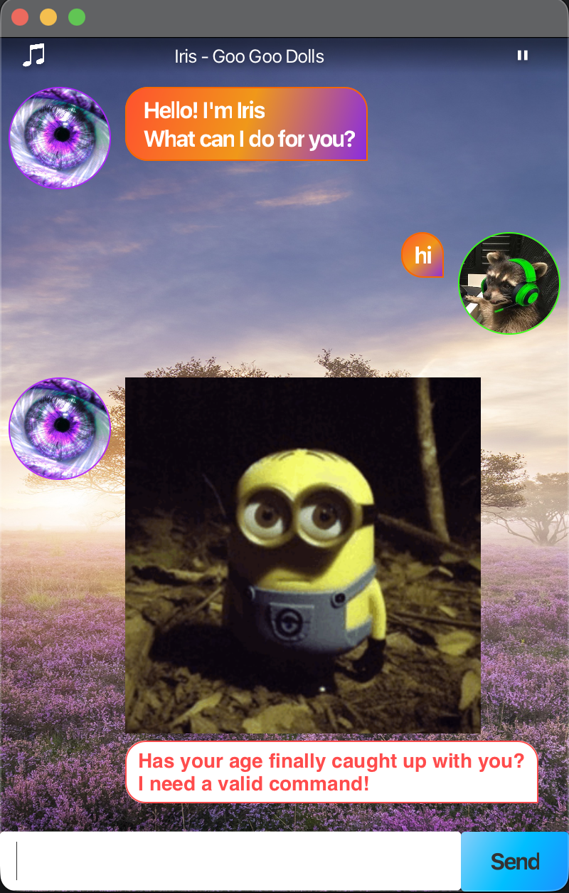

# 🌸 Iris User Guide

Iris is a simple chatbot that helps you track personal tasks, with a bit of flair and personality.


---

# 🚀 Getting Started

1. Run the application.
2. You will see:

```
Hello! I'm Iris
What can I do for you?
```
- Type "help" to see the list of commands available.

---

# 📋 Command Summary

| Command          | Format                                                      | Description                                  | Example                                                        |
|------------------|-------------------------------------------------------------|----------------------------------------------|----------------------------------------------------------------|
| **Add ToDo**     | `todo <description>`                                        | Adds a simple task without a date.           | todo read book                                                 |
| **Add Deadline** | `deadline <description> /by <date> (time)`                  | Adds a task with a due date.                 | deadline submit report /by 2026-02-20 17:30                    |
| **Add Event**    | `event <description> /from <date> (time) /to <date> (time)` | Adds a task with an event duration.          | event team meeting /from 2026-02-20 12:00 /to 2026-02-20 16:00 |
| **List Tasks**   | `list`                                                      | Displays all tasks.                          | list                                                           |
| **Mark Task**    | `mark <task number>`                                        | Marks the specified task as done.            | mark 3                                                         |
| **Unmark Task**  | `unmark <task number>`                                      | Marks the specified task as not done.        | unmark 3                                                       |
| **Delete Task**  | `delete <task number>`                                      | Deletes the specified task.                  | delete 4                                                       |
| **Find Tasks**   | `find <keyword>`                                            | Displays tasks containing the given keyword. | find meeting                                                   |
| **Help**         | `help`                                                      | lists down all commands and formats.         | help                                                           |
| **Exit Application** | `bye`                                                       | Exits the application.                       | bye                                                            |

---

# 🎵 Music

- Chatbot comes with a default music player at the top which can be paused using a button
- Only music available is [Iris - Goo Goo Dolls](https://youtu.be/NdYWuo9OFAw?si=aXo5P5vTFT5EXkeJ)

---

# 💾 Data Storage

- Tasks are automatically saved to a file.
- When you restart Iris, your tasks will still be available.
- In the case of corrupted save file, a clean slate will be used

---

# ⚠️ Notes

- Task numbers start from **1**.
- Commands are case-sensitive.
- Ensure the correct format is used for deadlines and events.
- Timing for deadlines and events are optional, it will be 00:00 by default
